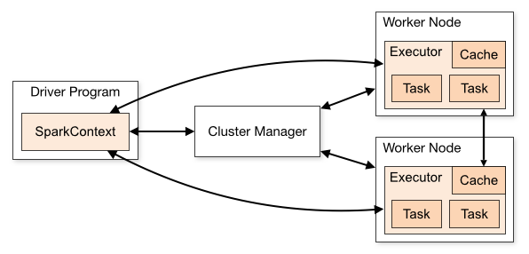

# Spark Tutorial

Spark - An engine for large scale data processing with high-level APIs in Java, Scala, Python, and R

## Important Commands
* Installation
    * `conda install pyspark` - if you just want to run pyspark
    * `brew install apache-spark` - if you want the full package (e.g. scala, example apps, etc.)
* Apache Spark CLI
    * `spark-shell` - initiate a spark shell (Scala) for running applications interactively
    * `pyspark` - initiate a pyspark shell
    * `spark-submit --master local[N] MyApp.py` - Start up and run a PySpark (or SparkR) application locally on `N` cores
* Running in Jupyter Notebook
    * `PYSPARK_DRIVER_PYTHON=jupyter`
    * `PYSPARK_DRIVER_PYTHON_OPTS=notebook`
    * `%pylab inline` in notebook before starting Spark

## Overview
* Spark runs as an application on a cluster (or machine if testing locally)

    * The user writes the code for the **driver program** that defines, initiates, and runs the application
    * An application initializes a **SparkContext** that connects to the cluster's **Cluster Manager** (or creates it if needed) through which the SparkContext aquires **executors** on **working nodes** within the cluster that run the computations and store data
        * Multiple spark applications can run on a cluster and use its cluster manager at the same time but data cannot be shared between different instances of a SparkContext
        * The Cluster Manager can be one of the supported managers (i.e. Apache Mesos, Hadoop YARN, or Kubernetes) or Spark's built-in standalone cluster manager
    * Throughout the application, the driver program listens for and accepts connections initiated by worker nodes while they are running so that it can respond appropriately by accepting outputs, retry failed jobs, etc.
    * Program data is managed by the user via the RDD abstraction that provides an API for manipulating data often as if it were stored with the driver program while coordinating commands across the nodes under the hood
* Spark Concepts
    * Dataset - distributed collection of items
        * RDD
            * Parallelized Collections
            * External Datasets
        * DataFrame - structured datasets implemented on top of RDDs
    * Parititions/Block vs Machine - parititions of the full dataset that get processed by an executor
    * SparkSession vs SparkContext, SQLContext, and HiveContext - Entry points into a spark application for Spark 2+ vs the older Spark 1. Sparksession provides a common API for the funcationality that existed separately in the older classes
    * Closure - the set of variables and methods needed for an executor's computations. SparkContext sends copies (not references) of everything in the closure to each executor
    * Caching
        * cluster-wide in-memory cache
    * Shared variables
        * broadcast variables
        * accumulators
    * Tasks, Jobs, Stages, Action -
        * Stages - components of a spark action
    * Par
    * master : local, hdfs
    * `U` and `T` Types
    * Directed Acyclic Graph (DAG)
    * Application UI HTML
    * Shuffling - re-distribution of data accross partitions to acheive a different grouping, usually by key
        * All functions that might force a shuffle may be able to avoid it under certain conditions
    

## Motivation
1. As the data to be processed gets large (e.g. TBs), it becomes slow or infeasible to process that data on a single machine no matter how optimized the algorithm is
1. Big data analysis, therefore, implements algorithms that can run many steps in parallel on subsets of the data distributed across a network of computers (a.k.a. cluster or grid). The final output still gets processed by single machine, though, such that it is identical to what a single machine would have produced.
1. The challenge is designing the exact programming model for parallelizing various algorithms and managing the network that has to move data around and monitor all the processes being run on different nodes. A lot of thought goes into models that scale well to large networks, efficiently allocate resources, and can handle smoothly all the problems that arise during runtime.
1. There is no one-size-fits-all solution for all big data analysis so different software and frameworks exist to handle different use cases (see Spark vs Hadoop)

## Background
* Big Data Concepts
    * **Parallel** vs **Distributed computing** - computing across multiple processors with access to the same memory (parallel) vs computing across multiple computers with indendent memory (distributed)
    * **Cluster** vs **Grid** - homogenous computer network, often a LAN, with nodes using the same hardware and OS (Cluster) vs a heterogenous computer network, often a WAN, with nodes using varying hardware and OS (Grid)
    * **Batch** vs **Stream/Real-time processing** - data is collected into batches and then processed at set times (Batch) vs being processed as it is the moment it is received (Stream)
    * **Process** vs **Thread** - A process contains a single thread or multiple threads. The process is the self-contained package of computing elements needed for a task while threads are self-contained sequeuences of executable steps that access some or all of the resources in their parent process to actually run the task
* Spark vs. Hadoop
    * **Hadoop** was designed for distributed computing tasks using a two-stage MapReduce model though nothing prevents it from being used for parallel computing
        * **MapReduce paradigm** - a model for distributed computing where data at each node is (1) mapped into key-value pairs that are then sent to new nodes, based on the key. The key-value pairs arriving at a single node are then (2) reduced to a new summary value before (3) being returned to the main node to be combined into single key-summaryValue dataset.
        * **Hadoop MapReduce** - a software implementation of the MapReduce paradigm by the Apache Software Foundation that works alongside other Hadoop components like HDFS, JobTracker, and YARN
    * Spark builds on Hadoop with an modifed model optimized for handling parallel computing tasks by defaulting to storing data in RAM for the duration of a process
        * Hadoop MapReduce (1) loads portions of data into RAM as needed for map steps, (2) writes to disk the output of mapping steps, (3) kills the mapping processes, and then (4) reads from disk the data needed for the reduce steps.
        * Spark loads the all requested data into RAM and then manages splitting that dataset, assigning data subsets to processes running in parallel, and combining the outputs.
    * Hadoop Distributed File System (HDFS) vs Resilient Distributed Dataset (RDD) - the file managment system for files in a Hadoop-native format that get processed by Hadooop MapReduce (HDFS) versus a dataset abstraction used by Spark when storing and accessing a dataset in RAM (RDD)
    * When to use Spark instead of Hadoop
        * Your computer (or cluster) has the available RAM to load in most if not all the target dataset
        * You need stream processing of data
        * Increased speed is worth the trade-off of less RAM being available for other jobs
        * You want built-in graph processing (GraphX) and machine learning (MLlib)
        * If Spark's slightly worse security and fault-tolerance is not a concern
* Apache Software Foundation (ASF): 
    * Hadoop, HDFS, YARN, Hive, and Pig 
    * Spark and RDD
    * HTTP Server 
    * Kafka
    * Mahout 
    * and [many others](https://en.wikipedia.org/wiki/List_of_Apache_Software_Foundation_projects)...

## References
* [Official Docs](https://spark.apache.org/docs/latest/index.html)
    * [General Programming Guides](https://spark.apache.org/docs/latest/quick-start.html) with examples in Python and Scala
    * [PySpark Documentation](https://spark.apache.org/docs/latest/api/python/index.html)
    * [Cluster Overview](https://spark.apache.org/docs/latest/cluster-overview.html)
